# MINI PROJECT

> Mini Project

<p align="center">
  <a href="https://reactjs.org/">
    Demo Apps
  </a>
</p>

----

## Table of contents
- [MINI PROJECT](#-mini-project)
  - [Table of contents](#table-of-contents)
  - [TODO Tasks](#todo-tasks)
  - [Stacks](#stacks)
  - [Build Setup](#build-setup)
  - [Screenshot](#Screenshot)

## TODO Tasks
- [x] CRUD Items taks via web
- [x] Move Items taks via web
- [x] Signin and authentication with JWT
- [x] Signuo and authentication with JWT

## Stacks
- ReactJS
- Redux
- React Hook Form
- Yup
- Tailwindcss
- Axios

## Build Setup
1. Clone repository
`https://github.com/rahmathidayatullah/mini-project.git`

2. Install depedencies
```bash
# with npm
$ npm install

# or with yarn
$ yarn install
```

3. Setup your environment variable in `.env` files (if not exists, create your own).
```env
REACT_APP_API_HOST=https://todos-project-api.herokuapp.com

```

4. Available scripts
```bash
# start development server
$ yarn start or npm run start

# built to production mode
$ yarn build or npm run build
```

## Screenshot

1. https://github.com/rahmathidayatullah/mini-project.git
   ##
   Form login
   ##
   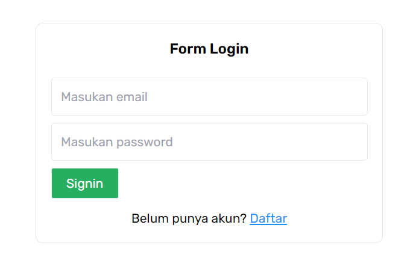 <br/>
   ## Alert form login
   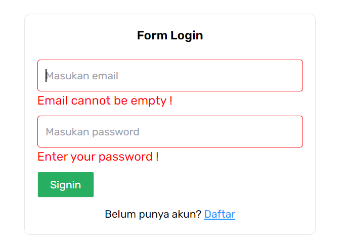
   ##
2. https://mini-project-puce.vercel.app/signup
   ##
   Signup
   ##
   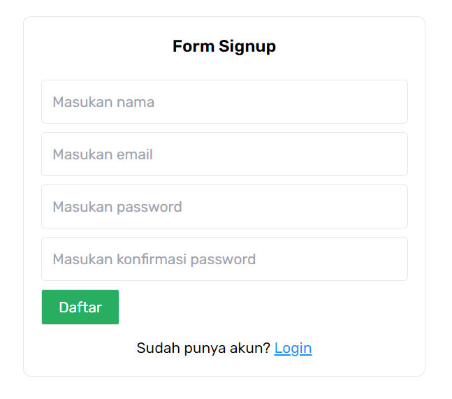
   ##
   Alert form Signup
   ##
   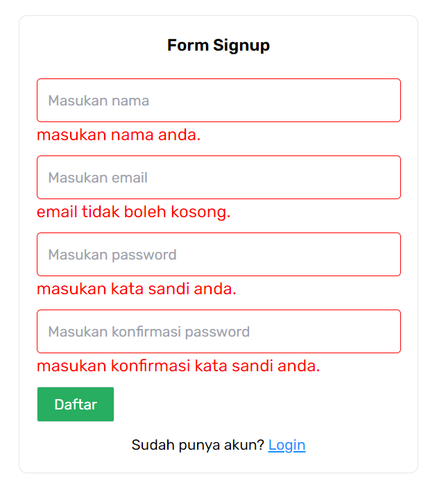

5. CRUD and alert Todos or Taks 
   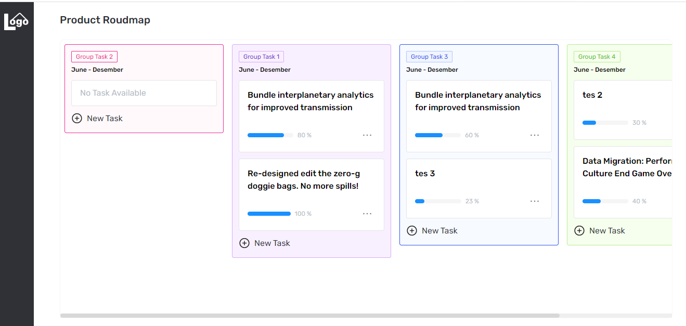
   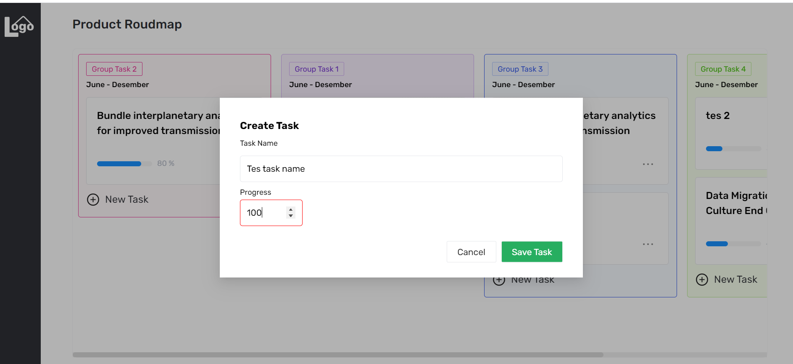
   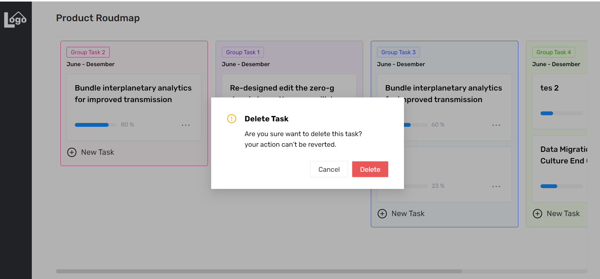
   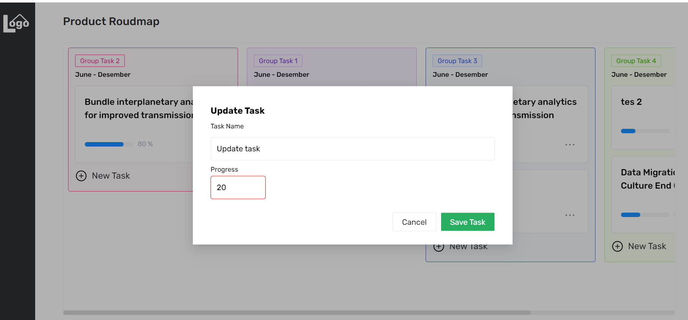
   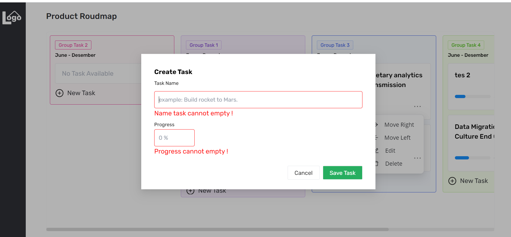
   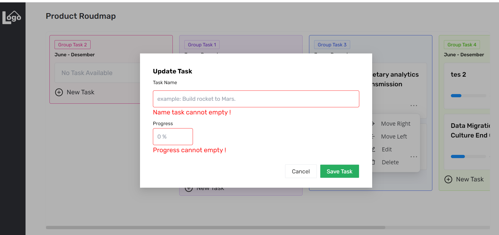
   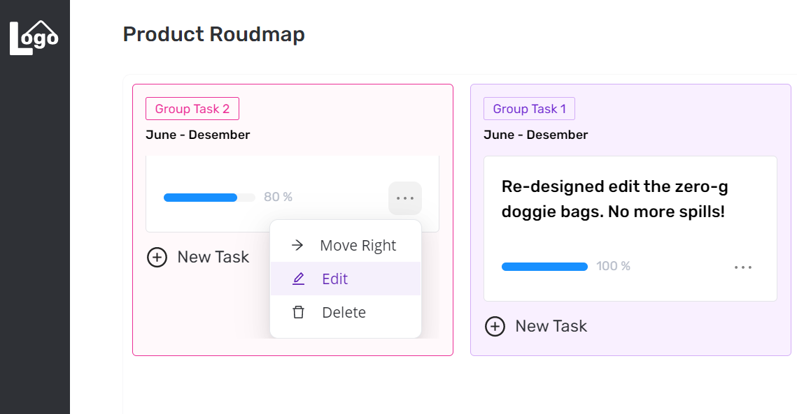
